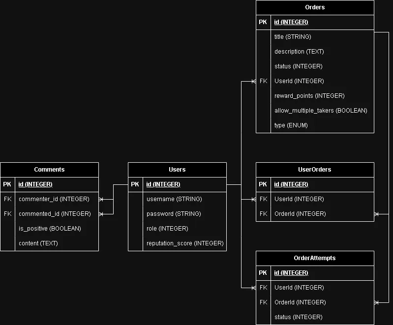

# Database schema

## Overview

There are 3 types of users:

- Giver
- Taker
- Admin - can update / delete anyone's comments / orders (Seeded only)

Both can make comments to each other, comments has data of the commenter and the commented.

Giver can make many Orders.

Multiple Taker can Attempt one Order.

History of Orders are saved in the OrderAttempts, listing the amount of attempts that Takers took to finally complete the Order. The early bird gets the worm, the remaining Takers who tried to finish said Order would be removed from the UserOrders Table.

## ERD diagram

## Users table

- `username` (String, Not Null, Unique): User's username.
- `password` (String, Not Null): Hashed password for user authentication.
- `role` (Integer, Not Null): User's role.
- `reputation_score` (Integer, Not Null, Default: 0): User's reputation score.

### Role mapping

- `0`: 'Taker'
- `1`: 'Giver'
- `2`: 'Admin'

## UserOrders table (junction table for many-to-many)

- `UserId` (Foreign Key, Not Null, Integer): User ID associated with a user.
- `OrderId` (Foreign Key, Not Null, Integer): Order ID associated with an order.

## Orders table

- `title` (String, Not Null): Title of the order.
- `description` (Text, Not Null): Description of the order.
- `status` (Integer, Not Null): Order's status.
- `UserId` (Foreign Key, Not Null, Integer): User ID associated with a giver.
- `reward_points` (Integer, Not Null): Points assigned as a reward for completing the order.
- `allow_multiple_takers` (Boolean, Not Null): Indicates whether the order can have multiple takers.
- `type` (Integer, Not Null): Order's type.

### Status mapping

- `0`: 'Open'
- `1`: 'On Going'
- `2`: 'Closed'

### Type mapping

- `0`: 'Delivery'
- `1`: 'Grocery Shopping'
- `2`: 'Pet Care'
- `3`: 'Household Chores'
- `4`: 'Technology Assistance'
- `5`: 'Study Buddy'
- `6`: 'Event Planning'
- `7`: 'Fitness Support'
- `8`: 'Meal Preparation'
- `9`: 'Companionship'

## Comments table

- `commenter_id` (Foreign Key, Not Null, Integer): User ID of the commenter (referencing `Users` table).
- `commented_id` (Foreign Key, Not Null, Integer): User ID of the user being commented on (referencing `Users` table).
- `is_positive` (Boolean, Not Null): True for a positive comment, False for a negative comment.
- `content` (Text, Not Null): Content of the comment.

## OrderAttempts table

- `OrderId` (Foreign Key, Not Null, Integer): Order ID associated with an order.
- `UserId` (Foreign Key, Not Null, Integer): User ID associated with a taker.
- `status` (Integer, Not Null): Order's status.

### Status mapping

- `0`: 'Failed'
- `1`: 'Completed'
